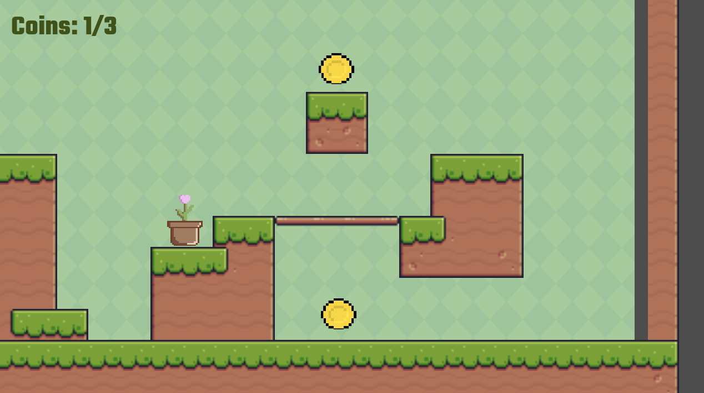

# Haven Platformer

## Quick Start
Want to play? Play [Haven Platformer on itch.io](https://ohkay404.itch.io/haven-platformer) now!

## Features
- Move the flower pot around the map and collect all three coins to win.
- Use left/right arrow keys or A/D keys to move left and right.
- Use the spacebar, W key, or Up arrow key to jump.

## How to Run Haven Platformer Locally
1. Clone this repository.
2. Import the project into Godot ver. 4.4.1.
3. Click run project to start the game.

## Credits
- Tilemap, Font, and Background: [GitHub](https://github.com/russs123/Godot-Platformer)
- Coin: [itch.io](https://gabriel-ceppas.itch.io/coin)
